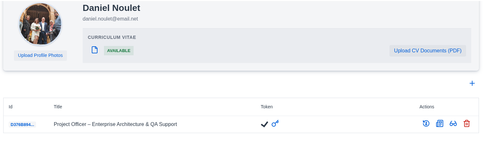
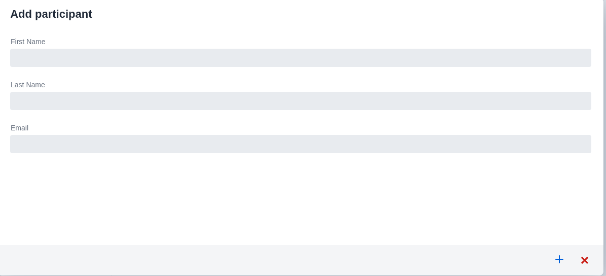
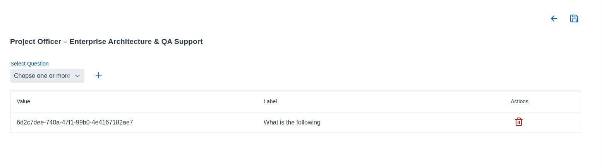

# Invitation Api (IPI)

## Endpoint /v1/invitations

| Url                   |                        Action                         | Response status | development |    role     |
|:----------------------|:-----------------------------------------------------:|:---------------:|:-----------:|:-----------:|
| POST /                |                 Creates a invitation                  |       201       |     🟢      | USER, ADMIN |
| PUT /:id              |                 Updates an invitation                 |       200       |     🟢      | USER, ADMIN |
| GET /:id              |     Retrieves the invitation for a invitation id      |       200       |     🟢      | USER,ADMIN  |
| GET /participants/:id | Retrieves all invitations for a specific participant  |       200       |     🟢      | USER, ADMIN |
| DELETE /:id           |                 Deletes an invitation                 |       204       |     🟢      | USER, ADMIN |
| GET /:id/generate     | Generates a token for the invitation for the given id |       201       |     🟢      | USER, ADMIN |

## User Stories

### US IPI 1: [API] Create an invitation 🟢

#### Context

As a system, the system can create an invitation.

#### Model

```java
public interface InvitationClient {
    @Operation(
            method = "POST",
            tags = "invitations",
            operationId = "create",
            summary = "Creates an invitation",
            parameters = {
                    @Parameter(name = "X-Correlation-Id", in = ParameterIn.HEADER, schema = @Schema(implementation = UUID.class))
            },
            requestBody = @io.swagger.v3.oas.annotations.parameters.RequestBody(
                    content = @Content(schema = @Schema(implementation = CreateInvitation.class), mediaType = MediaType.APPLICATION_JSON_VALUE, encoding = @Encoding(contentType = MediaType.APPLICATION_JSON_VALUE))

            ),
            responses = {
                    @ApiResponse(
                            responseCode = "201",
                            content = @Content(schema = @Schema(implementation = Invitation.class))
                    ),
                    @ApiResponse(
                            responseCode = "400",
                            content = @Content(schema = @Schema(implementation = ProblemDetail.class))
                    ),
                    @ApiResponse(
                            responseCode = "500",
                            content = @Content(schema = @Schema(implementation = ProblemDetail.class))
                    )
            }
    )
    @PostMapping(produces = MediaType.APPLICATION_JSON_VALUE, consumes = MediaType.APPLICATION_JSON_VALUE)
    @ResponseStatus(HttpStatus.CREATED)
    @NonNull
    Invitation create(@RequestBody @NonNull CreateInvitation createInvitation);
}
```

```json
{
  "participant_id": "11111111-1111-1111-1111-111111111111",
  "publication_id": "22222222-2222-2222-2222-222222222222"
}
```

```java
public record CreateInvitation(
        @NonNull @Valid @NotNull @JsonProperty("participant_id") UUID participantId,
        @NonNull @Valid @NotNull @JsonProperty("publication_id") UUID publicationId
) {
}
```

```sql
CREATE TABLE invitations
(
    ID             UUID PRIMARY KEY,
    participant_id UUID         NOT NULL,
    publication_id UUID         NOT NULL,
    stored_token   VARCHAR(255) NULL,
    created_by     VARCHAR(50)  NOT NULL,
    updated_by     VARCHAR(50),
    CREATED_AT     TIMESTAMP WITHOUT TIME ZONE default now(),
    UPDATED_AT     TIMESTAMP WITHOUT TIME ZONE,
    CONSTRAINT fk_invitations_publications FOREIGN KEY (publication_id)
        REFERENCES publications (id) ON DELETE CASCADE
);

CREATE TABLE invitation_questions
(
    invitation_id UUID NOT NULL,
    question_id   UUID NOT NULL,
    CONSTRAINT fk_invitation FOREIGN KEY (invitation_id)
        REFERENCES invitations (id) ON DELETE CASCADE,
    PRIMARY KEY (invitation_id, question_id)
);

CREATE INDEX idx_invitation_questions_invitation ON invitation_questions (invitation_id);
```

#### Usage

POST https://url/v1/invitions -b {"participant_id": "11111111-1111-1111-1111-111111111111","publication_id":"
22222222-2222-2222-2222-222222222222"}

### US IPI 2: [API] Update an invitation 🟢

#### Context

As a system, the system can update an invitation.

#### Model

```java
public interface InvitationClient {
    @Operation(
            method = "PUT",
            tags = "invitations",
            operationId = "update",
            summary = "Updates an invitation",
            parameters = {
                    @Parameter(name = "X-Correlation-Id", in = ParameterIn.HEADER, schema = @Schema(implementation = UUID.class)),
                    @Parameter(name = "id", in = ParameterIn.PATH, schema = @Schema(implementation = UUID.class))
            },
            requestBody = @io.swagger.v3.oas.annotations.parameters.RequestBody(
                    content = @Content(schema = @Schema(implementation = UpdateInvitation.class), mediaType = MediaType.APPLICATION_JSON_VALUE, encoding = @Encoding(contentType = MediaType.APPLICATION_JSON_VALUE))

            ),
            responses = {
                    @ApiResponse(
                            responseCode = "201",
                            content = @Content(schema = @Schema(implementation = Invitation.class))
                    ),
                    @ApiResponse(
                            responseCode = "400",
                            content = @Content(schema = @Schema(implementation = ProblemDetail.class))
                    ),
                    @ApiResponse(
                            responseCode = "500",
                            content = @Content(schema = @Schema(implementation = ProblemDetail.class))
                    )
            }
    )
    @PutMapping(path = "/{id}", produces = MediaType.APPLICATION_JSON_VALUE, consumes = MediaType.APPLICATION_JSON_VALUE)
    @ResponseStatus(HttpStatus.OK)
    @NonNull
    Invitation update(@PathVariable(name = "id") UUID invitationId, @RequestBody @NonNull UpdateInvitation updateInvitation);
}
```

```json
{
  "questions": [
    "11111111-1111-1111-1111-111111111111",
    "22222222-2222-2222-2222-222222222222"
  ]
}
```

```java
public record UpdateInvitation(@NonNull List<@NonNull UUID> questions) {
}
```

#### Usage

PUT https://url/v1/invitions/33333333-3333-3333-3333-333333333333 -b {"
questions": ["11111111-1111-1111-1111-111111111111","22222222-2222-2222-2222-222222222222"]}

### US IPI 3: [API] Create invitation 🟢

#### Context

As a system, the system can retrieve the invitation.

#### Model

```java
public interface InvitationClient {
    @Operation(
            method = "GET",
            tags = "invitations",
            summary = "Retrieve the invitation corresponding to the id",
            operationId = "findById",
            parameters = {
                    @Parameter(name = "X-Correlation-Id", in = ParameterIn.HEADER, schema = @Schema(implementation = UUID.class))
            },
            responses = {
                    @ApiResponse(
                            responseCode = "200",
                            content = @Content(schema = @Schema(implementation = Invitation.class))
                    ),
                    @ApiResponse(
                            responseCode = "404",
                            content = @Content(schema = @Schema(implementation = ProblemDetail.class))
                    )
            }
    )
    @GetMapping(path = "{id}", produces = MediaType.APPLICATION_JSON_VALUE)
    @ResponseStatus(HttpStatus.OK)
    @NonNull
    Invitation findById(@PathVariable(name = "id") @NonNull UUID invitationId);
}
```

```json
{
  "id": "33333333-3333-3333-3333-333333333333",
  "publication": {
    "id": "11111111-1111-1111-1111-111111111111",
    "title": "title of the job",
    "description": "what the job is ",
    "proposal": "what we give",
    "position": {
      "position": "lead developer"
    },
    "level": {
      "level": "SENIOR"
    }
  },
  "participant_id": "22222222-2222-2222-2222-222222222222",
  "stored_token": "8Am9x_t3eVokFwF6",
  "questions": [
    "55555555-5555-5555-5555-555555555555"
  ]
}
```

```java response
public record Invitation(
        @NonNull UUID id,
        @NonNull Publication publication,
        @JsonProperty("participant_id")
        @NonNull UUID participantId,

        @JsonProperty("stored_token")
        String storedToken,
        @NonNull List<@NonNull UUID> questions
) {
    public Invitation(UUID id, UUID participantId, @NonNull Publication publication, String storedToken) {
        this(id, publication, participantId, storedToken, new ArrayList<>());
    }
}
```

#### Usage

PUT https://url/v1/invitions/33333333-3333-3333-3333-333333333333

### US IPI 4: [API] Retrieves all invitation for a participant id 🟢

#### Context

As a system, the system can retrieve all the invitation of a participant.

#### Model

```java
public interface InvitationClient {
    @Operation(
            method = "GET",
            tags = "invitations",
            summary = "Retrieves the invitations corresponding to the participant id",
            operationId = "findInvitationsByParticipantId",
            parameters = {
                    @Parameter(name = "X-Correlation-Id", in = ParameterIn.HEADER, schema = @Schema(implementation = UUID.class))
            },
            responses = {
                    @ApiResponse(
                            responseCode = "200",
                            content = @Content(array = @ArraySchema(schema = @Schema(implementation = Invitation.class)))
                    ),
                    @ApiResponse(
                            responseCode = "404",
                            content = @Content(schema = @Schema(implementation = ProblemDetail.class))
                    )
            }
    )
    @GetMapping(path = "/participants/{id}", produces = MediaType.APPLICATION_JSON_VALUE)
    @ResponseStatus(HttpStatus.OK)
    @NonNull
    List<@NonNull Invitation> findInvitationsByParticipantId(@PathVariable(name = "id") @NonNull UUID participantId);
}
```

```json
[
  {
    "id": "33333333-3333-3333-3333-333333333333",
    "publication": {
      "id": "11111111-1111-1111-1111-111111111111",
      "title": "title of the job",
      "description": "what the job is ",
      "proposal": "what we give",
      "position": {
        "position": "lead developer"
      },
      "level": {
        "level": "SENIOR"
      }
    },
    "participant_id": "22222222-2222-2222-2222-222222222222",
    "stored_token": "8Am9x_t3eVokFwF6",
    "questions": [
      "55555555-5555-5555-5555-555555555555"
    ]
  }
]
```

```java
public record Invitation(
        @NonNull UUID id,
        @NonNull Publication publication,
        @JsonProperty("participant_id")
        @NonNull UUID participantId,

        @JsonProperty("stored_token")
        String storedToken,
        @NonNull List<@NonNull UUID> questions
) {
    public Invitation(UUID id, UUID participantId, @NonNull Publication publication, String storedToken) {
        this(id, publication, participantId, storedToken, new ArrayList<>());
    }
}
```

#### Usage

PUT https://url/v1/invitions/participants/33333333-3333-3333-3333-333333333333

### US IPI 5: [API] Delete an invitation 🟢

#### Context

As a system, the system can delete an invitation.

#### Model

```java
public interface InvitationClient {
    @Operation(
            method = "DELETE",
            tags = "invitations",
            summary = "Deletes the invitation corresponding to the id",
            operationId = "deleteById",
            parameters = {
                    @Parameter(name = "X-Correlation-Id", in = ParameterIn.HEADER, schema = @Schema(implementation = UUID.class))
            },
            responses = {
                    @ApiResponse(
                            responseCode = "204"
                    ),
                    @ApiResponse(
                            responseCode = "404",
                            content = @Content(schema = @Schema(implementation = ProblemDetail.class))
                    )
            }
    )
    @DeleteMapping(path = "{id}", produces = MediaType.APPLICATION_JSON_VALUE)
    @ResponseStatus(HttpStatus.NO_CONTENT)
    void deleteById(@PathVariable(name = "id") @NonNull UUID invitationId);
}
```

#### Usage

DELETE https://url/v1/invitions/33333333-3333-3333-3333-333333333333

### US IPI 6: [API] Generate token for an invitation 🟢

#### Context

As a system, the system can generate a token for an invitation.

#### Model

```java
public interface InvitationClient {
    @Operation(
            method = "GET",
            tags = "invitations",
            summary = "Generates a token",
            operationId = "generateToken",
            parameters = {
                    @Parameter(name = "X-Correlation-Id", in = ParameterIn.HEADER, schema = @Schema(implementation = UUID.class)),
                    @Parameter(name = "id", in = ParameterIn.PATH, schema = @Schema(implementation = UUID.class))
            },
            responses = {
                    @ApiResponse(
                            responseCode = "204"
                    ),
                    @ApiResponse(
                            responseCode = "404",
                            content = @Content(schema = @Schema(implementation = ProblemDetail.class))
                    )
            }
    )
    @GetMapping(path = "{id}/generate", produces = MediaType.APPLICATION_JSON_VALUE)
    @ResponseStatus(HttpStatus.CREATED)
    @NonNull
    Invitation generateToken(@PathVariable(name = "id") @NonNull UUID invitationId);
}
```

```json
{
  "id": "33333333-3333-3333-3333-333333333333",
  "publication": {
    "id": "11111111-1111-1111-1111-111111111111",
    "title": "title of the job",
    "description": "what the job is ",
    "proposal": "what we give",
    "position": {
      "position": "lead developer"
    },
    "level": {
      "level": "SENIOR"
    }
  },
  "participant_id": "22222222-2222-2222-2222-222222222222",
  "stored_token": "8Am9x_t3eVokFwF6",
  "questions": [
    "55555555-5555-5555-5555-555555555555"
  ]
}
```

```java
public record Invitation(
        @NonNull UUID id,
        @NonNull Publication publication,
        @JsonProperty("participant_id")
        @NonNull UUID participantId,

        @JsonProperty("stored_token")
        String storedToken,
        @NonNull List<@NonNull UUID> questions
) {
    public Invitation(UUID id, UUID participantId, @NonNull Publication publication, String storedToken) {
        this(id, publication, participantId, storedToken, new ArrayList<>());
    }
}
```

#### Usage

GET https://url/v1/invitions/33333333-3333-3333-3333-333333333333/generate

### US IPI 7: [UI] List Invitations 🟢



#### Context

As a logged-in user, I can view the invitations.

#### Vaadin Endpoint: InvitationEndpoint

- AllowedRoles: USER, ADMIN
- ParticipantApi.findInvitationsByParticipantId(participantId)

#### Operation

```java

@BrowserCallable
@RolesAllowed({"USER", "ADMIN"})
public class InvitationEndpoint {
    public @NonNull List<@NonNull Invitation> findInvitationsByParticipantId(@NonNull UUID participantId) {
        return invitationClient.findInvitationsByParticipantId(participantId);
    }
}
```

#### Usage

This operation is used in the UI to retrieve all invitations.

#### Button

👓 goes to the detail page of the invitation\
🗑 deletes the invitation

### US IPI 8: [UI] Create invitation 🟢



#### Context

As a logged-in user, I can create a new invitation.

#### Vaadin Endpoint: InvitationEndpoint

- AllowedRoles: USER, ADMIN
- ParticipantApi.create(createActivity)

#### Operation

```java

@BrowserCallable
@RolesAllowed({"USER", "ADMIN"})
public class InvitationEndpoint {
    public @NonNull Invitation create(@NonNull CreateInvitation createInvitation) {
        return invitationClient.create(createInvitation);
    }
}
```

#### Usage

This operation is used in the UI to create an invitation.

### US IPI 9: [UI] Invitation detail 🟢



#### Context

As a logged-in user, I can view an invitation.

#### Vaadin Endpoint: InvitationEndpoint

- AllowedRoles: USER, ADMIN
- ParticipantApi.findById(invitationId)

#### Operation

```java

@BrowserCallable
@RolesAllowed({"USER", "ADMIN"})
public class InvitationEndpoint {
    public @NonNull Invitation findById(@NonNull UUID invitationId) {
        return invitationClient.findById(invitationId);
    }
}
```

#### Usage

This operation is used in the UI to retrieve an invitation.

#### Button

💾 updated the invitation\
⬅ returns to the invitation overview (see [IPI 7](#context-7))\
🗑 removes the question from the list (need to press 💾 to update)

